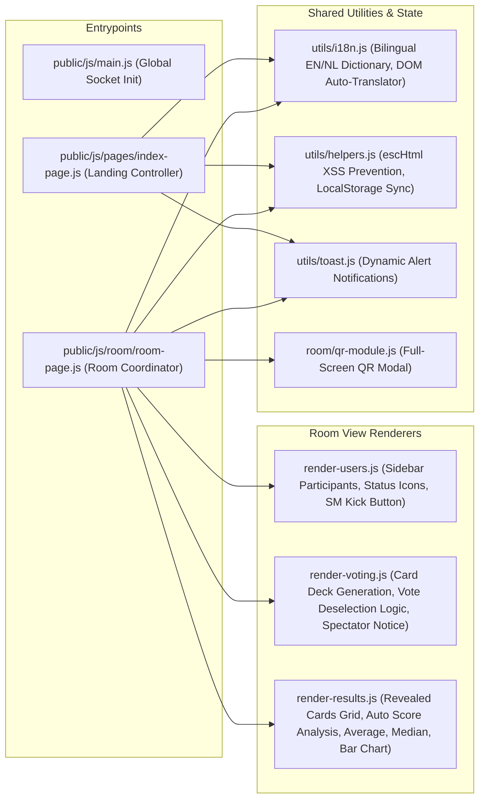
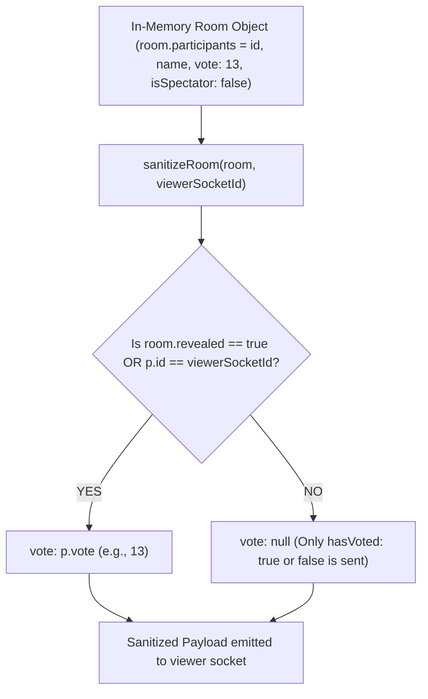

# 🏛️ System Architecture & Components

The Scrum Poker application is built around a **Zero-Latency In-Memory Architecture**. By eliminating external database bottlenecks (such as SQL or MongoDB) in the hot-path of real-time voting rounds, the application achieves instantaneous responsiveness and runs effortlessly on lightweight hardware, Docker, or Unraid instances via a single Node.js process.

---

## 🧩 Modular Frontend (ES Modules)

The frontend relies entirely on **native ES Modules (`type="module"`)** and browser DOM APIs without any heavy external UI frameworks (like React or Vue). This guarantees zero bundler overhead, instant cold starts, and maximum flexibility.



---

## 🔒 Security & Data Filtering (`sanitizeRoom`)

A fundamental security principle in the backend is that **unrevealed votes must never leak across client packets**. Even if a user opens browser dev tools or connects via a custom script, the server strictly filters out all real vote values from other participants while the room is unrevealed (`room.revealed === false`).



---

## 🛡️ Rate Limiting & Denial of Service Protection

To guard against rogue clients or scripts flooding the server with thousands of socket emissions per second, the Socket.IO connection pipeline includes a **per-socket token-bucket rate limiter** (`src/socket/index.js`).

```javascript
// Maximum 35 events per second per socket connection
let eventCount = 0;
let lastReset  = Date.now();

socket.use((_packet, next) => {
  const now = Date.now();
  if (now - lastReset > 1000) { eventCount = 0; lastReset = now; }
  if (++eventCount > 35) {
    socket.emit('error', { message: 'Too many actions. Please wait a second.' });
    return;
  }
  next();
});
```

The REST layer (`src/routes/api.js`) has its own **two-layer fixed-window limiter** (`src/utils/rateLimiter.js`, `createRateLimiter`), because many distinct users can present as a single client IP — a shared office connection, or a reverse proxy in front of the app:

1. A generous **300 requests/minute per IP** ceiling across all REST endpoints, as a broad defense-in-depth cap.
2. A tighter **30 requests/minute per (IP, room ID)** budget on the room-specific endpoints (`/rooms/:id`, `/rooms/:id/qr`), via a custom `keyFn`. This is the layer that actually matters day-to-day: it stops one room's QR endpoint from being hammered, without letting unrelated rooms behind the same apparent IP share a single budget — e.g. several teams running poker sessions from the same office WiFi don't throttle each other.

`/health` is registered *before* both limiters so Docker's `HEALTHCHECK` is never throttled. Exceeding a limit returns `429` with a `Retry-After` header and a JSON error body.

By default Express sees the raw socket IP, so behind a reverse proxy every client collapses to the proxy's address — the per-room layer above still isolates different rooms in that case, but the per-IP ceiling would apply to the whole proxy's traffic. Set the `TRUST_PROXY` env var (`src/config.js`) when a reverse proxy you control is in front, so `req.ip` reflects the real client via `X-Forwarded-For` — only do this when that proxy actually strips/overwrites client-supplied `X-Forwarded-For`, otherwise a client can spoof its IP and dodge rate limiting entirely.

---

## 🧯 Malformed Input & Crash Hardening

Beyond rate limiting, every inbound socket event passes through a **safe dispatch layer** (`src/socket/index.js`) so that a single malformed message from any client can never throw an uncaught exception and crash the Node process (which would wipe **every** active room, not just the offender's).

- **Payload defaulting** — a missing or `null` event payload is coerced to `{}` before it reaches a handler, so destructuring `{ roomId }` never throws.
- **Error isolation** — each handler runs inside a `try/catch`; a thrown error is logged server-side and a generic error toast is returned to the offending socket instead of propagating.
- **Prototype-safe store** — the rooms dictionary is created with `Object.create(null)` (`src/store/rooms.js`), so attacker-supplied room IDs such as `__proto__` or `constructor` resolve to `undefined` rather than a truthy prototype value that would slip past the `if (!room)` guard.
- **Canonical room IDs** — every handler normalizes the client-supplied `roomId` (trim + uppercase) via `normalizeRoomId()` (`src/utils/roomId.js`), removing silent no-ops from case differences and narrowing the lookup surface.

```javascript
// src/socket/index.js — safe dispatch wrapper wired to every event
const on = (event, handler) => {
  socket.on(event, (data = {}) => {
    try {
      handler(data || {});
    } catch (err) {
      console.error(`[handler:${event}] ${socket.id}`, err);
      socket.emit('error', { message: 'Er ging iets mis. Probeer het opnieuw.' });
    }
  });
};
```

> These guarantees are locked in by the `tests/robustness.test.js` suite, which fires every event with missing, `null`, and prototype-key payloads and asserts the server stays alive.
