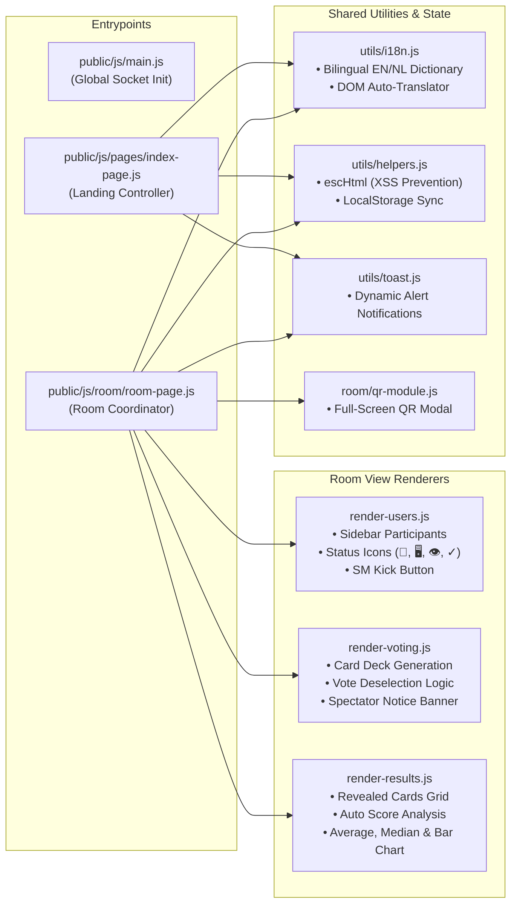
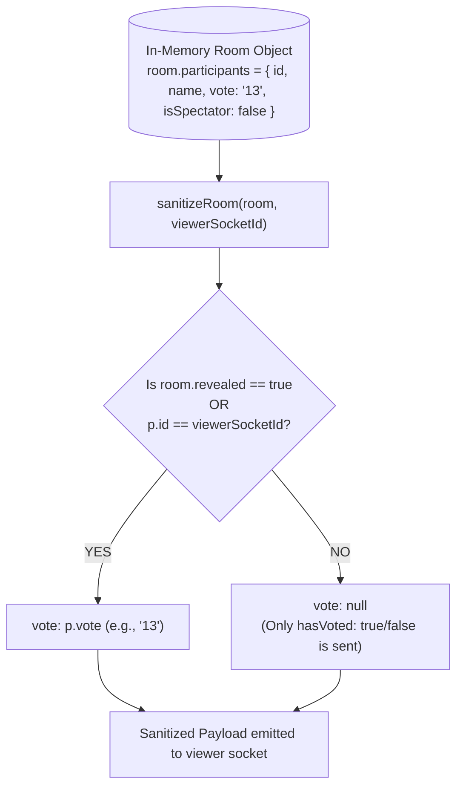

# 🏛️ System Architecture & Components

The Scrum Poker application is built around a **Zero-Latency In-Memory Architecture**. By eliminating external database bottlenecks (such as SQL or MongoDB) in the hot-path of real-time voting rounds, the application achieves instantaneous responsiveness and runs effortlessly on lightweight hardware, Docker, or Unraid instances via a single Node.js process.

---

## 🧩 Modular Frontend (ES Modules)

The frontend relies entirely on **native ES Modules (`type="module"`)** and browser DOM APIs without any heavy external UI frameworks (like React or Vue). This guarantees zero bundler overhead, instant cold starts, and maximum flexibility.



---

## 🔒 Security & Data Filtering (`sanitizeRoom`)

A fundamental security principle in the backend is that **unrevealed votes must never leak across client packets**. Even if a user opens browser dev tools or connects via a custom script, the server strictly filters out all real vote values from other participants while the room is unrevealed (`room.revealed === false`).



---

## 🛡️ Rate Limiting & Denial of Service Protection

To guard against rogue clients or scripts flooding the server with thousands of socket emissions per second, the Socket.IO connection pipeline includes a **per-socket token-bucket rate limiter** (`src/socket/index.js`).

```javascript
// Maximum 35 events per second per socket connection
let eventCount = 0;
let lastReset  = Date.now();

socket.use((_packet, next) => {
  const now = Date.now();
  if (now - lastReset > 1000) { eventCount = 0; lastReset = now; }
  if (++eventCount > 35) {
    socket.emit('error', { message: 'Too many actions. Please wait a second.' });
    return;
  }
  next();
});
```
