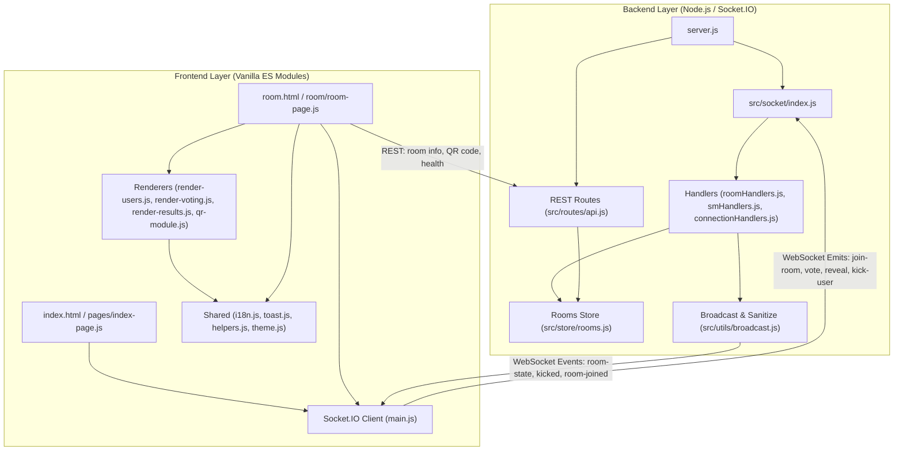

# 📂 Complete Repository File Structure & Module Directory

This document provides a comprehensive, exhaustive breakdown of every directory and file inside the **Scrum Poker** codebase. The repository strictly separates server-side Node.js/Express/Socket.IO logic (`src/` & `server.js`) from client-side vanilla ES Modules (`public/`).

---

## 🌳 Full Directory & File Tree

```text
scrum-poker-collab/
├── 📄 server.js                          # Main backend HTTP & Socket.IO server entrypoint
├── 📄 Dockerfile                         # Lightweight Alpine Node.js container build script
├── 📄 docker-compose.yml                 # Docker Compose multi-container deployment & healthcheck
├── 📄 package.json                       # Node.js project manifest & script commands (`start`, `dev`)
├── 📄 package-lock.json                  # Exact dependency version lockfile
├── 📄 README.md                          # Project overview, installation instructions & wiki index
├── 📄 .gitignore                         # Git exclusion rules (`node_modules`, `.env`)
├── 📄 .dockerignore                      # Docker build context exclusion rules
│
├── 📁 docs/wiki/                         # 📚 Technical Documentation & Mermaid Diagrams Wiki
│   ├── index.md                          # Wiki home page & high-level system diagram
│   ├── architecture.md                   # ES Module topology, data sanitization & rate limiting
│   ├── lifecycle.md                      # Room state transitions, 15m grace period & 24h cleanup
│   ├── socket-flows.md                   # Sequence diagrams for voting rounds & kick actions
│   ├── roles.md                          # SM vs Voter vs Spectator permission matrix & progress logic
│   └── file-structure.md                 # (This file) Comprehensive directory & module breakdown
│
├── 📁 src/                               # ⚙️ Backend Node.js / Express / Socket.IO Source Code
│   ├── 📄 config.js                      # Central server configuration (ports, CORS, 15m timeout, decks)
│   ├── 📁 routes/
│   │   └── 📄 api.js                     # RESTful API endpoints (`/api/rooms/:id` verification, `/health`)
│   ├── 📁 socket/
│   │   ├── 📄 index.js                   # Socket.IO bootstrap, safe dispatch (payload guard + error isolation) & 35 req/sec rate limiter
│   │   └── 📁 handlers/
│   │       ├── 📄 connectionHandlers.js  # Disconnect grace period (`RECONNECT_GRACE_PERIOD_MS`) & kick-user
│   │       ├── 📄 roomHandlers.js        # `create-room`, `join-room`, `vote`, `toggle-spectator`, `claim-master`, `sm-transfer-master`
│   │       └── 📄 smHandlers.js          # Scrum Master commands (`reveal`, `reset`, `change-deck`, `update-story-title`)
│   ├── 📁 store/
│   │   └── 📄 rooms.js                   # In-memory room dictionary (null-prototype), `deleteRoom` & `sanitizeRoom`
│   └── 📁 utils/
│       ├── 📄 broadcast.js               # `broadcastRoomState` (with `sanitizeRoom`) & 24h cleanup timer
│       └── 📄 roomId.js                  # 6-character room code generator (`ABC123`) & `normalizeRoomId` canonicalizer
│
└── 📁 public/                            # 🎨 Client-Side Frontend (Static HTML, CSS Variables, ES Modules)
    ├── 📄 index.html                     # Landing / Home page (`/` -> create or join room)
    ├── 📄 room.html                      # Active planning room page (`/room.html?id=...`)
    ├── 📄 style.css                      # Global stylesheet (Dark/Light themes, glassmorphism, animations)
    └── 📁 js/                            # Client-Side ES Modules (`type="module"`)
        ├── 📄 config.js                  # Central frontend configuration (`export const APP_NAME = 'Scrum Poker'`)
        ├── 📄 main.js                    # Global client bootstrap & Socket.IO client initialization
        ├── 📄 theme.js                   # Dark/Light mode theme switcher (`localStorage` + DOM classes)
        ├── 📁 pages/
        │   └── 📄 index-page.js          # Landing page controller (Create room tab, join code form, deck preview)
        ├── 📁 room/
        │   ├── 📄 room-page.js           # Master room coordinator (event listeners, modals, wake lock, socket sync)
        │   ├── 📄 render-users.js        # Sidebar participant list, status icons (👑/🖥️/👁️/✓), SM kick button (`✕`)
        │   ├── 📄 render-voting.js       # Card deck grid generation, vote selection/deselection, spectator banner
        │   ├── 📄 render-results.js      # Post-reveal grid, automated consensus analysis, average/median & bar chart
        │   └── 📄 qr-module.js           # Full-screen interactive QR code generator & invite link sharing
        └── 📁 utils/
            ├── 📄 helpers.js             # Shared utilities (`escHtml` XSS prevention, localStorage helpers)
            ├── 📄 i18n.js                # Bilingual dictionary (`EN` / `NL`), `t(key)` formatter, DOM auto-translator
            └── 📄 toast.js               # Non-blocking animated floating toast notification system (`toast(msg, type)`)
```

---

## 🔍 Module Responsibility Matrix


