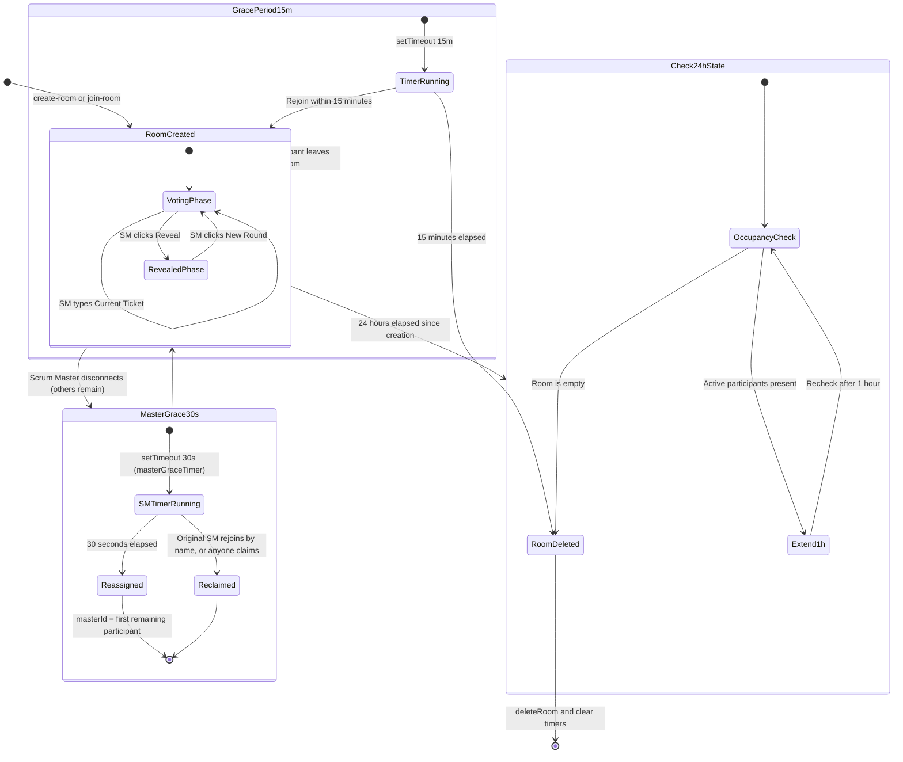

# 🔄 Room Lifecycle & State Transitions

Because all rooms reside in-memory (`src/store/rooms.js`), it is vital that inactive or abandoned sessions are reliably cleaned up to prevent memory leaks, while active sessions remain completely protected against temporary network disruptions.

---

## 🧭 Lifecycle State Diagram

The diagram below illustrates the exact lifecycle of a room from initial creation through voting rounds, reconnect grace periods, and final deletion.



---

## 👑 The 30-Second Scrum Master Reconnect Grace (`masterGraceTimer`)

When the **Scrum Master disconnects but other participants are still present**, the role is not reassigned immediately. `connectionHandlers.js` starts a **30-second** `masterGraceTimer`:

1. **SM Disconnect (room not empty)**: on `disconnect`, if the leaver was the master and participants remain, `room.masterGraceTimer = setTimeout(..., 30000)` starts.
2. **Reclaim within 30s**: the original SM can reclaim the role by rejoining with the **same display name** (`handleJoinRoom` matches `masterName` case-insensitively), and any participant can take over via `claim-master`. Either path clears the timer.
3. **Auto-Reassign after 30s**: if the window elapses, `masterId` is reassigned to the first remaining participant, who receives a `became-master` event.

> ⚠️ **Trust model:** name-match reclaim means anyone joining with the departed SM's name during the window inherits the role. This is an accepted trade-off for an account-less tool — the room code is the real access boundary. See [Roles & Permissions](./roles.md#-scrum-master-reconnect-trust-model).

---

## ⏳ The 15-Minute Empty Room Grace Period (`RECONNECT_GRACE_PERIOD_MS`)

When the last participant in a room accidentally closes their browser tab, drops Wi-Fi, or locks their smartphone screen, the room is not wiped immediately. Instead, `connectionHandlers.js` starts a countdown grace period of exactly **15 minutes (`900,000 ms`)**:

1. **Disconnect Event**:  
   The server intercepts the socket `disconnect` and checks if `Object.keys(room.participants).length === 0`.
2. **Start Grace Timer**:  
   If the room is completely empty, `room.disconnectTimer = setTimeout(..., RECONNECT_GRACE_PERIOD_MS)` is initialized.
3. **Rejoin (Within 15 Minutes)**:  
   As soon as any participant opens the room URL or reconnects (`join-room`), `clearTimeout(room.disconnectTimer)` cancels the wipe. The room state, votes, and active ticket title are restored instantly without data loss.
4. **Final Deletion (After 15 Minutes)**:  
   If the room remains empty for 15 full minutes, `deleteRoom(roomId)` clears all internal timer handles and purges the room from memory.

---

## 🕒 The 24-Hour Cleanup Timer with Smart Extension (`scheduleRoomCleanup`)

Every room receives a hard ceiling timer of **24 hours** upon creation (`broadcast.js`).  
To prevent an active all-day planning workshop from terminating abruptly when the 24-hour mark is reached, this timer incorporates an **active occupancy check**:

```javascript
export function scheduleRoomCleanup(roomId) {
  const room = rooms[roomId];
  if (!room) return;
  if (room.cleanupTimer) clearTimeout(room.cleanupTimer);

  room.cleanupTimer = setTimeout(() => {
    const r = rooms[roomId];
    if (!r) return;
    if (Object.keys(r.participants).length > 0) {
      console.log(`[cleanup] Room ${roomId} still active after 24h, extending by 1h.`);
      scheduleRoomCleanup(roomId); // Re-schedule for another 1 hour
      return;
    }
    deleteRoom(roomId);
  }, 24 * 60 * 60 * 1000);
}
```
