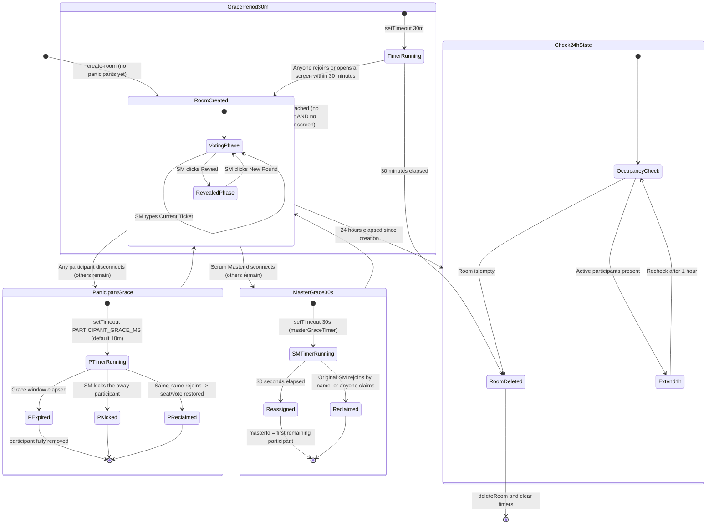

# 🔄 Room Lifecycle & State Transitions

Because all rooms reside in-memory (`src/store/rooms.js`), it is vital that inactive or abandoned sessions are reliably cleaned up to prevent memory leaks, while active sessions remain completely protected against temporary network disruptions.

---

## 🧭 Lifecycle State Diagram

The diagram below illustrates the exact lifecycle of a room from initial creation through voting rounds, reconnect grace periods, and final deletion.



---

## 👤 Personal Reconnect Grace for Any Participant (`PARTICIPANT_GRACE_MS`)

Previously, **any** disconnect removed a participant from `room.participants` immediately — a phone locking its screen (suspending the tab/network) would drop them out of the room and lose their vote on the spot. `connectionHandlers.js` now keeps their seat for a **personal grace window** instead:

1. **Disconnect**: the participant is marked `connected: false` with a `disconnectedAt` timestamp — **not deleted**. Their vote, `hasVoted`, role and spectator state are all preserved. A per-participant `setTimeout` (`room.participantGraceTimers[socketId]`) starts, default **10 minutes**.
2. **While away**: they still appear in the participant list (dimmed in the UI, "away" tooltip) and still count toward the voting total — the round doesn't silently shrink around them.
3. **Reconnect (within the window)**: a new connection always gets a **new** `socket.id`, so `handleJoinRoom` migrates the old entry to the new id by matching the **session token** the client replays (`p.sessionToken === token`) — vote, `hasVoted`, role and spectator state all transfer over, and the stale entry + its timer are removed. Display names are never used for this; see the [trust model](./roles.md#-scrum-master-reconnect-trust-model). A client presenting no token is a new participant and migrates nothing.
4. **Connection-race handling**: matching is **not** gated on the old entry already being `connected: false`. A flaky connection can have the client reconnect *before* the server's ping-timeout notices the old socket died, so the old entry may still read `connected: true` at that moment. If so, `handleJoinRoom` force-evicts the old live socket (`socket.disconnect(true)`, with a `kicked` event so that connection — if anyone's still watching it — gets the same "removed" messaging as an SM kick) before migrating, so one person never ends up with two simultaneous rows. This eviction is safe precisely because the token proves it is the same person — two different people who happen to share a display name each keep their own seat.
5. **Expiry**: if the window elapses with no reconnect, `expireParticipantGrace()` deletes the participant for good and broadcasts the updated room.
6. **Explicit removal**: the Scrum Master can `kick-user` an away participant at any time, bypassing the grace window entirely.

Override the default via the `PARTICIPANT_GRACE_MINUTES` env var (see README). Transferring the Scrum Master role to an away participant is rejected — the target must be currently connected.

---

## 👑 The 30-Second Scrum Master Reconnect Grace (`masterGraceTimer`)

When the **Scrum Master disconnects but other participants are still present**, the role is not reassigned immediately. `connectionHandlers.js` starts a **30-second** `masterGraceTimer`:

1. **SM Disconnect (room not empty)**: on `disconnect`, if the leaver was the master and participants remain, `room.masterGraceTimer = setTimeout(..., 30000)` starts.
2. **Reclaim within 30s**: the original SM can reclaim the role by rejoining with their **session token** (`handleJoinRoom` compares it against `room.masterToken`), and any participant can take over openly via `claim-master`. Either path clears the timer.
3. **Auto-Reassign after 30s**: if the window elapses, `masterId` is reassigned to the first remaining connected participant, who receives a `became-master` event. The timer handle is cleared on **every** path — including when there is nobody left to hand the role to, in which case the role stays vacant and `handleJoinRoom` gives it to the next joiner.

> 🔐 **Trust model:** the reclaim is token-based, so typing the departed SM's display name grants nothing. See [Roles & Permissions](./roles.md#-scrum-master-reconnect-trust-model).

---

## ⏳ The 30-Minute Unattended Room Grace Period (`RECONNECT_GRACE_PERIOD_MS`)

When the last person in a room closes their browser tab, drops Wi-Fi, or locks their phone, the room is not wiped immediately. `connectionHandlers.js` starts a countdown of **30 minutes (`1,800,000 ms`)** — long enough to survive a coffee break or a lunch:

1. **Disconnect Event**:  
   The server intercepts the socket `disconnect` and checks whether anything is still attached (see the personal grace period above — a lone disconnecting participant doesn't empty the room instantly, but the check runs off active connections, not raw entry count).
2. **Start Grace Timer**:  
   Only when `isRoomUnattended()` holds — **no connected participant *and* no presenter screen in `room.displays`** — is `room.disconnectTimer = setTimeout(..., RECONNECT_GRACE_PERIOD_MS)` armed. A team at lunch with the screen still up has not abandoned the room, so the countdown does not run; it starts instead when that last screen closes.
3. **Return (Within 30 Minutes)**:  
   As soon as anyone rejoins (`join-room`) or opens a presenter screen (`watch-room`), the pending wipe is cancelled. Room state, votes and the active ticket title are restored without data loss.
4. **Final Deletion (After 30 Minutes)**:  
   The timer re-checks `isRoomUnattended()` when it fires rather than trusting the state at scheduling time, since anyone may have returned meanwhile. If the room really is unattended, `closeRoom(roomId)` notifies any screens with `room-closed`, then clears all internal timer handles and purges the room from memory.

> ⚠️ **Note the gap with the personal grace period.** A disconnected participant's seat expires after `PARTICIPANT_GRACE_MS` (10 minutes), but the room itself survives for 30. Return after 20 minutes and the room is still there while your seat is not: you rejoin with a fresh seat, no vote, and — if nobody else is left — as the new host. That is deliberate (the room code stays valid across a break), not an oversight.

---

## 🕒 The 24-Hour Cleanup Timer with Smart Extension (`scheduleRoomCleanup`)

Every room receives a hard ceiling timer of **24 hours** upon creation (`broadcast.js`).  
To prevent an active all-day planning workshop from terminating abruptly when the 24-hour mark is reached, this timer incorporates an **active occupancy check**:

```javascript
export function scheduleRoomCleanup(roomId) {
  const room = rooms[roomId];
  if (!room) return;
  if (room.cleanupTimer) clearTimeout(room.cleanupTimer);

  room.cleanupTimer = setTimeout(() => {
    const r = rooms[roomId];
    if (!r) return;
    // Deliberately ignores displays: a room nobody has joined in 24 hours is
    // done, even if a forgotten screen is still pointed at it.
    if (Object.keys(r.participants).length > 0) {
      info('cleanup', `Room ${roomId} nog in gebruik na 24u, verlengd.`);
      scheduleRoomCleanup(roomId);
      return;
    }
    closeRoom(roomId); // notifies any watching screens first
  }, ROOM_CLEANUP_INTERVAL_MS);
}
```
