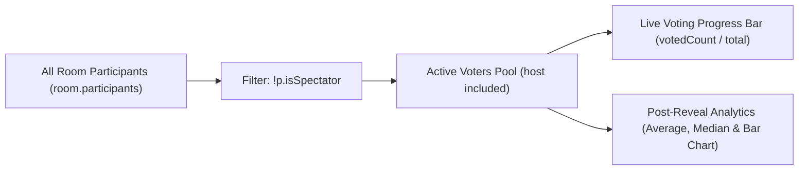

# 👑 Roles & Permissions (Host vs. Voter vs. Spectator vs. Display)

Scrum Poker separates three things that used to be bundled into one role: **who may run the session**, **who is voting**, and **which screens are showing it**. Keeping them apart is what lets the facilitator put the session on a big screen and still estimate from their own phone.

---

## 📊 Role & Permission Matrix

| Capability / Feature | 👑 Host (Scrum Master) | 🃏 Voter (Participant) | 👁️ Spectator | 📺 Presenter screen |
| :--- | :---: | :---: | :---: | :---: |
| **Select / Deselect Estimation Cards** | ✅ Yes | ✅ Yes | ❌ (View only) | ❌ Not a person |
| **Reveal All Votes (`reveal`)** | ✅ Yes | ❌ No | ❌ No | ✅ Yes |
| **Start New Round (`reset`)** | ✅ Yes | ❌ No | ❌ No | ✅ Yes |
| **Update Current Ticket / Story Title** | ✅ Yes (Live input) | ❌ Read-only banner | ❌ Read-only banner | ✅ Yes (Live input) |
| **Change Card Deck (`change-deck`)** | ✅ Yes | ❌ No | ❌ No | ✅ Yes |
| **Toggle Auto-Reveal** | ✅ Yes | ❌ No | ❌ No | ✅ Yes |
| **Kick Participants (`kick-user`)** | ✅ Yes | ❌ No | ❌ No | ✅ Yes |
| **Hand the host role to someone (`sm-transfer-master`)** | ✅ Yes | ❌ No | ❌ No | ❌ No (not a participant) |
| **Enlarge Full-Screen QR Code Modal** | ✅ Yes | ❌ No | ❌ No | ✅ Shows it permanently |
| **Counted in Voting Progress Bar (%)** | ✅ **Included** | ✅ **Included** (unless offline and not yet voted) | ❌ **Excluded** | ❌ Not in `participants` |
| **Included in Average / Median / Chart** | ✅ **Included** | ✅ **Included** | ❌ **Excluded** | ❌ Not in `participants` |
| **Toggle Spectator Role Live** | ✅ Yes | ✅ Can become Spectator | ✅ Can become Voter | ❌ n/a |

A host who does not want to estimate toggles **spectator**, the same as anyone else. That is now the only way to sit a round out.

### Who the round is waiting on

The denominator behind every "3 / 4 gestemd", and the condition auto-reveal fires on, is one predicate — `eligibleVoters()`, in `src/utils/autoReveal.js` on the server and mirrored in `public/js/utils/stats.js` on the client. The two must agree, or the bar contradicts the reveal that just replaced it.

Someone is part of the round unless:

- they are a **spectator** — they opted out; or
- they are **offline and have not voted**. Their seat is held for the grace window (a locked phone should not cost you your place), but a round cannot wait on someone who is not there. Before this rule, one dropped connection stalled auto-reveal and pinned the progress bar for the full ten minutes.

Someone who voted and *then* dropped off still counts: their vote is in the round, so dropping them would change the tally.

---

## 📺 Presenter Screens Are Not Participants

A presenter screen attaches with `watch-room`, not `join-room`. It joins the Socket.IO room so it receives broadcasts, and its socket id goes into `room.displays`, but it never appears in `room.participants`.

That one decision does most of the work:

- It falls outside every vote calculation without a single filter having to know it exists.
- It needs none of the session-token or eviction machinery a participant needs (see the trust model below) — that exists because a participant owns a seat, a vote and possibly the host role, and a screen owns nothing.
- **Multiple screens on one room are therefore free**, which covers a hybrid meeting with one screen in the room and another shared into a call. A screen that reloads briefly appears twice, which is harmless.
- Screens receive `sanitizeRoom(room, null)` — the strictest view there is. A screen has no own vote, so it sees nothing at all until the reveal.

Because a display is not a participant, the empty-room countdown keys on both: it starts only when there is no connected participant **and** no screen. See [Room Lifecycle](./lifecycle.md).

### But it still runs the session

A screen is not a passive monitor — it is the facilitator's dashboard. Reveal, new round, deck, story title, auto-reveal and kick all work from it, so you can run the session from the big screen while estimating from your own phone. That was the whole reason to separate presenting from the host role.

Authorisation for all of those goes through one predicate, `canControlRoom(room, socketId)` in `src/store/rooms.js`:

```javascript
export function canControlRoom(room, socketId) {
  if (!room) return false;
  return room.masterId === socketId || Boolean(room.displays?.has(socketId));
}
```

This grants a screen no more reach than the room code already does: `claim-master` has always been open to anyone who can join, so the code — not the role — is the trust boundary. `sm-transfer-master` stays host-only, because handing over a seat among participants is not something a screen has standing to do.

---

## 🎯 Progress Bar & Statistics Calculation Logic

Only `isSpectator: true` excludes someone from the live voting denominator (`voters.length`) and post-reveal analytics. Presenter screens never reach these calculations, because they are not in `room.participants` to begin with.



### Code Implementation (`room-page.js` & `render-results.js`)

```javascript
// Filter only active estimation voters
const voters = room.participants.filter(p => !p.isSpectator);
const voted  = voters.filter(p => p.hasVoted).length;
const total  = voters.length;

// Calculate progress percentage accurately
const pct = total > 0 ? Math.round((voted / total) * 100) : 0;
smProgressFill.style.width = `${pct}%`;
smProgressText.textContent = t('progress-text', { voted, total });
```

The server-side equivalent lives in `src/utils/autoReveal.js`, where `eligibleVoters()` is shared by the auto-reveal condition and the reveal log line so the two cannot disagree about who counts.

---

## 🙋 Who Becomes Host

`create-room` takes no display name — creating a room is setting up the presenter screen, and a screen is not a person. The room starts with `masterId: null`.

The **first client to `join-room`** claims the vacant role, which is the branch `handleJoinRoom` already had for a room without a host. So the usual flow needs no extra step: put the room on the big screen, scan the QR with your phone, and your phone is the host.

---

## 🔐 Scrum Master Reconnect Trust Model

When the Scrum Master disconnects, the room does not immediately reassign the role. A **30-second grace timer** (`masterGraceTimer`) starts, during which the original SM can reclaim the role by rejoining.

Reclaim is gated on a **per-session reconnect token** (`src/utils/sessionToken.js`), never on the display name:

- The server mints a 128-bit token on a client's first `join-room` and returns it in `room-joined`. The client stores it under `scrum_token_<ROOMID>` in `localStorage` and replays it on every later join (refresh, tab wake-up, socket reconnect).
- The token is **never** part of `sanitizeRoom` output, so it only ever reaches the one client that owns it.
- `room.masterToken` holds the current SM's token. Reclaim succeeds only when a joining client presents that exact token while the grace timer is still pending.
- A client with no (or an unrecognised) token is simply a new participant: it never inherits a seat, a vote or the master role.
- `room.masterName` still exists, but for display and logging only — it grants nothing.

**Why not names:** display names are user-chosen and non-unique. Matching on them meant two people called "Jan" were treated as one person (the second joiner evicted the first and inherited their vote), and anyone could take the Scrum Master role by simply typing the SM's name during the grace window.

The room code remains the outer access boundary: anyone who has it can join and can take the role openly via `claim-master`. What the token removes is *silent* impersonation of a specific existing participant.

If the grace timer expires without a reclaim, the role falls to the first remaining connected participant. If nobody is left to receive it, the role stays vacant and the next joiner takes it.

The same token model applies to **any** participant reconnecting, not just the SM — see [Personal Reconnect Grace](./lifecycle.md#-personal-reconnect-grace-for-any-participant-participant_grace_ms) in the lifecycle doc, including the forced-eviction behavior for the connection-race case.
