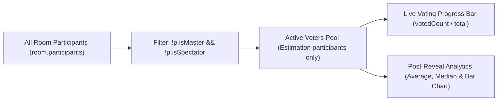

# 👑 Roles & Permissions (SM vs. Voter vs. Spectator)

Scrum Poker categorizes participants into three distinct operational roles. Each role determines which dashboard controls, status icons, and voting interfaces are rendered, as well as how statistical consensus is calculated upon card reveal.

---

## 📊 Role & Permission Matrix

| Capability / Feature | 👑 Scrum Master | 🃏 Voter (Participant) | 👁️ Spectator |
| :--- | :---: | :---: | :---: |
| **Select / Deselect Estimation Cards** | ❌ (Presenter mode) | ✅ Yes | ❌ (View only) |
| **Reveal All Votes (`reveal`)** | ✅ Yes | ❌ No | ❌ No |
| **Start New Round (`reset`)** | ✅ Yes | ❌ No | ❌ No |
| **Update Current Ticket / Story Title** | ✅ Yes (Live input) | ❌ Read-only banner | ❌ Read-only banner |
| **Change Card Deck (`change-deck`)** | ✅ Yes | ❌ No | ❌ No |
| **Kick Participants (`kick-user`)** | ✅ Yes | ❌ No | ❌ No |
| **Enlarge Full-Screen QR Code Modal** | ✅ Yes | ❌ No | ❌ No |
| **Counted in Voting Progress Bar (%)** | ❌ Excluded | ✅ **Included** | ❌ **Excluded** |
| **Included in Average / Median / Chart** | ❌ Excluded | ✅ **Included** | ❌ **Excluded** |
| **Toggle Spectator Role Live** | ❌ No | ✅ Can become Spectator | ✅ Can become Voter |

---

## 🎯 Progress Bar & Statistics Calculation Logic

To ensure accurate Agile story sizing, any participant marked as `isMaster: true` or `isSpectator: true` is automatically excluded from both the live voting denominator (`voters.length`) and post-reveal score analytics.



### Code Implementation (`room-page.js` & `render-results.js`)

```javascript
// Filter only active estimation voters
const voters = room.participants.filter(p => !p.isMaster && !p.isSpectator);
const voted  = voters.filter(p => p.hasVoted).length;
const total  = voters.length;

// Calculate progress percentage accurately
const pct = total > 0 ? Math.round((voted / total) * 100) : 0;
smProgressFill.style.width = `${pct}%`;
smProgressText.textContent = t('progress-text', { voted, total });
```

---

## 🔐 Scrum Master Reconnect Trust Model

When the Scrum Master disconnects, the room does not immediately reassign the role. A **30-second grace timer** (`masterGraceTimer`) starts, during which the original SM can reclaim the role by rejoining.

Reclaim is gated on a **per-session reconnect token** (`src/utils/sessionToken.js`), never on the display name:

- The server mints a 128-bit token on a client's first `join-room` and returns it in `room-joined`. The client stores it under `scrum_token_<ROOMID>` in `localStorage` and replays it on every later join (refresh, tab wake-up, socket reconnect).
- The token is **never** part of `sanitizeRoom` output, so it only ever reaches the one client that owns it.
- `room.masterToken` holds the current SM's token. Reclaim succeeds only when a joining client presents that exact token while the grace timer is still pending.
- A client with no (or an unrecognised) token is simply a new participant: it never inherits a seat, a vote or the master role.
- `room.masterName` still exists, but for display and logging only — it grants nothing.

**Why not names:** display names are user-chosen and non-unique. Matching on them meant two people called "Jan" were treated as one person (the second joiner evicted the first and inherited their vote), and anyone could take the Scrum Master role by simply typing the SM's name during the grace window.

The room code remains the outer access boundary: anyone who has it can join and can take the role openly via `claim-master`. What the token removes is *silent* impersonation of a specific existing participant.

If the grace timer expires without a reclaim, the role falls to the first remaining connected participant. If nobody is left to receive it, the role stays vacant and the next joiner takes it.

The same token model applies to **any** participant reconnecting, not just the SM — see [Personal Reconnect Grace](./lifecycle.md#-personal-reconnect-grace-for-any-participant-participant_grace_ms) in the lifecycle doc, including the forced-eviction behavior for the connection-race case.
