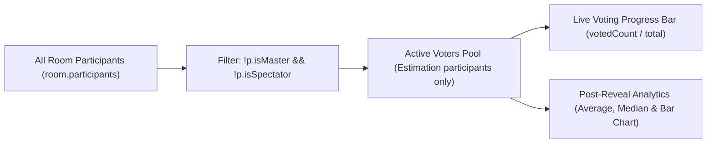

# 👑 Roles & Permissions (SM vs. Voter vs. Spectator)

Scrum Poker categorizes participants into three distinct operational roles. Each role determines which dashboard controls, status icons, and voting interfaces are rendered, as well as how statistical consensus is calculated upon card reveal.

---

## 📊 Role & Permission Matrix

| Capability / Feature | 👑 Scrum Master | 🃏 Voter (Participant) | 👁️ Spectator |
| :--- | :---: | :---: | :---: |
| **Select / Deselect Estimation Cards** | ❌ (Presenter mode) | ✅ Yes | ❌ (View only) |
| **Reveal All Votes (`reveal`)** | ✅ Yes | ❌ No | ❌ No |
| **Start New Round (`reset`)** | ✅ Yes | ❌ No | ❌ No |
| **Update Current Ticket / Story Title** | ✅ Yes (Live input) | ❌ Read-only banner | ❌ Read-only banner |
| **Change Card Deck (`change-deck`)** | ✅ Yes | ❌ No | ❌ No |
| **Kick Participants (`kick-user`)** | ✅ Yes | ❌ No | ❌ No |
| **Enlarge Full-Screen QR Code Modal** | ✅ Yes | ❌ No | ❌ No |
| **Counted in Voting Progress Bar (%)** | ❌ Excluded | ✅ **Included** | ❌ **Excluded** |
| **Included in Average / Median / Chart** | ❌ Excluded | ✅ **Included** | ❌ **Excluded** |
| **Toggle Spectator Role Live** | ❌ No | ✅ Can become Spectator | ✅ Can become Voter |

---

## 🎯 Progress Bar & Statistics Calculation Logic

To ensure accurate Agile story sizing, any participant marked as `isMaster: true` or `isSpectator: true` is automatically excluded from both the live voting denominator (`voters.length`) and post-reveal score analytics.



### Code Implementation (`room-page.js` & `render-results.js`)

```javascript
// Filter only active estimation voters
const voters = room.participants.filter(p => !p.isMaster && !p.isSpectator);
const voted  = voters.filter(p => p.hasVoted).length;
const total  = voters.length;

// Calculate progress percentage accurately
const pct = total > 0 ? Math.round((voted / total) * 100) : 0;
smProgressFill.style.width = `${pct}%`;
smProgressText.textContent = t('progress-text', { voted, total });
```

---

## 🔐 Scrum Master Reconnect Trust Model

When the Scrum Master disconnects, the room does not immediately reassign the role. A **30-second grace timer** (`masterGraceTimer`) starts, during which the original SM can reclaim the role by rejoining.

Reclaim is gated **only on a case-insensitive display-name match** (`handleJoinRoom` in `src/socket/handlers/roomHandlers.js`). Consequences:

- The reconnect flow is frictionless and requires no account or token.
- **Trade-off:** during the grace window, anyone who joins using the departed SM's name is handed the master role. This is accepted for a lightweight, account-less tool.

If a room needs stronger guarantees, issue a per-session reconnect token on `room-created` / `room-joined` and verify it on rejoin instead of comparing names. If the grace timer expires without a reclaim, the role falls to the first remaining participant.
