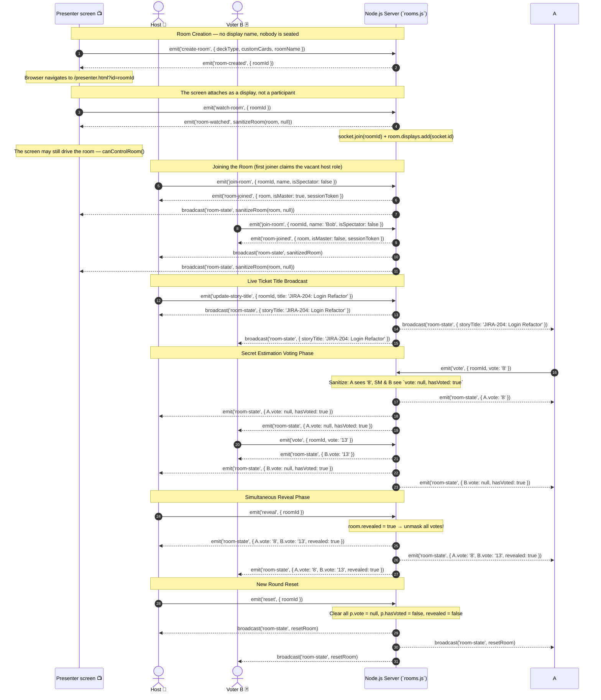
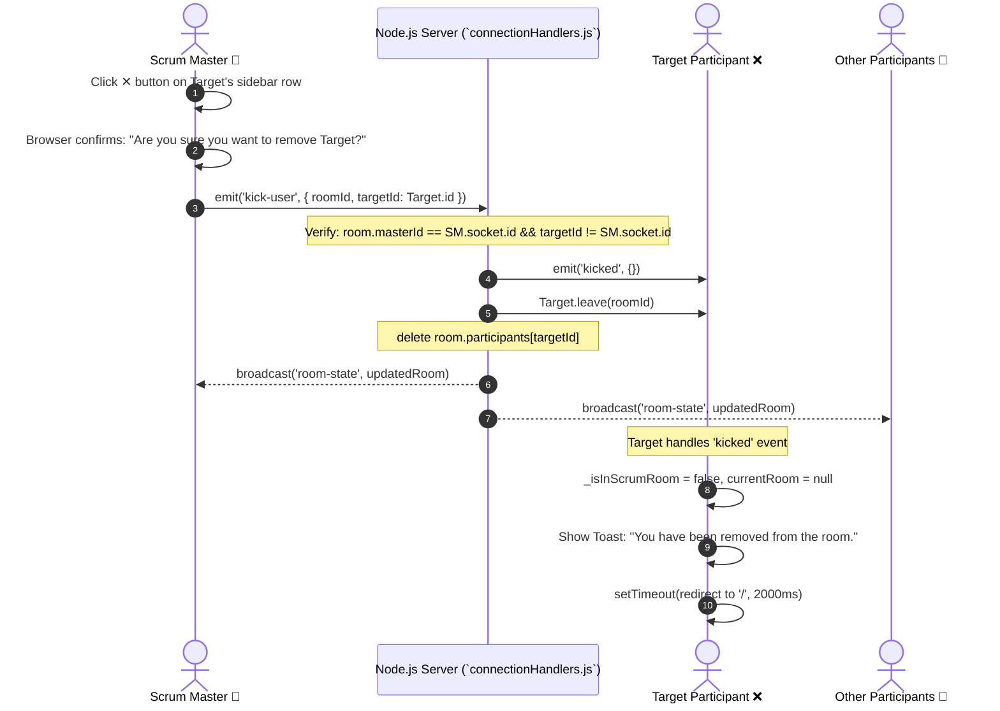
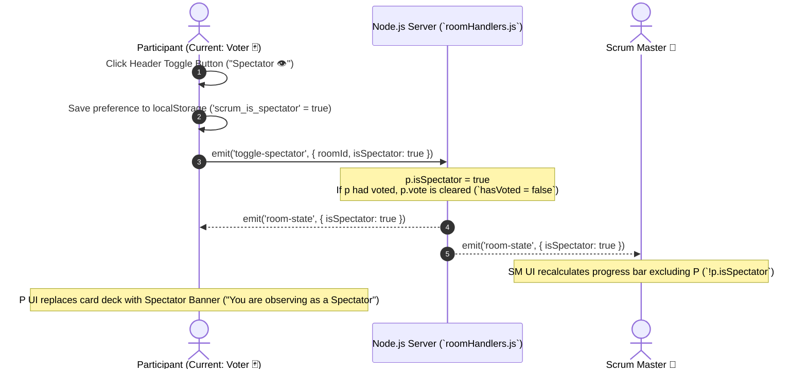

# ⚡ Real-Time Socket.IO Sequence Flows

All communication during active planning rounds happens over bi-directional **Socket.IO** WebSockets. This document breaks down the exact interaction sequences for creating, joining, voting, revealing, kicking, spectator toggling, and Scrum Master handoff.

---

## 🃏 Voting Round Sequence (Join → Vote → Reveal → Reset)

The sequence below traces the journey of a presenter screen (`P`), a Host (`SM`), a Voter (`Voter B`), and the `Server` during a standard planning estimation cycle.



---

## 🚫 User Kick Sequence (`handleKickUser`)

When a Scrum Master needs to remove an unwanted, duplicate, or glitching participant from the room, the following sequence executes.



---

## 👁️ Spectator Toggle Sequence (`toggle-spectator`)

Any non-master participant can switch between **Voter** and **Spectator** dynamically without leaving or reloading the page.



---

## 👑 Scrum Master Handoff (`sm-transfer-master`, `claim-master`, disconnect grace)

The Scrum Master role can change hands three ways. Note that `claim-master` is intentionally **open to any participant** — the room code is the trust boundary, not the role. See [Roles & Permissions](./roles.md) for the full trust model.

```mermaid
sequenceDiagram
    autonumber
    actor SM as Scrum Master 👑
    actor P as Participant 🃏
    participant S as Node.js Server (`roomHandlers.js` / `connectionHandlers.js`)

    Note over SM,S: Path 1 — Explicit Transfer (SM hands off)
    SM->>S: emit('sm-transfer-master', { roomId, targetId: P.id })
    Note over S: Verify room.masterId == SM.id && P is a participant
    S->>P: emit('became-master', {})
    S-->>SM: broadcast('room-state', { P.isMaster: true })
    S-->>P: broadcast('room-state', { P.isMaster: true })

    Note over P,S: Path 2 — Claim (any participant may take over)
    P->>S: emit('claim-master', { roomId })
    Note over S: Clears masterGraceTimer if pending; no ownership check
    S->>P: emit('became-master', {})
    S-->>P: broadcast('room-state', { P.isMaster: true })

    Note over SM,S: Path 3 — Disconnect Grace (SM drops unexpectedly)
    SM--xS: socket 'disconnect' (other participants remain)
    Note over S: Start masterGraceTimer = setTimeout(30s)
    alt Original SM rejoins with their session token within 30s
        SM->>S: emit('join-room', { roomId, name, sessionToken })
        Note over S: token matches masterToken → reclaim role, cancel timer
        S-->>SM: emit('room-joined', { room, isMaster: true, sessionToken })
    else 30 seconds elapse
        Note over S: masterId = first remaining connected participant
        S->>P: emit('became-master', {})
        S-->>P: broadcast('room-state', updatedRoom)
    end
```
