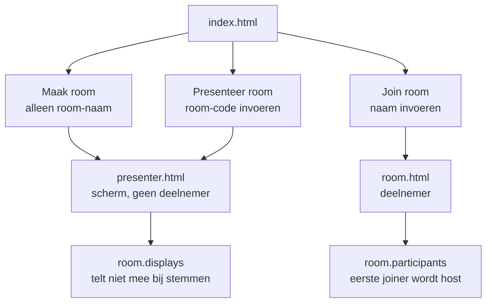

# 📋 TODO / Ideeënlijst

Backlog van ideeën en verbeterpunten die uit de codebase-review zijn gekomen.
Afgeronde items staan onderaan.

---

## 🎯 Functioneel

### 1. Ronde-historie + export
**Waarde: hoog.** Nu worden bij elke "nieuwe ronde" de resultaten gewist zonder dat er iets bewaard blijft. Een team dat 10 stories schat, houdt achteraf niets over.

- Log per ronde: `storyTitle`, individuele stemmen, gemiddelde/mediaan, tijdstip.
- Zichtbaar in een paneel of modal voor de Scrum Master.
- Knop "Kopieer als Markdown" / "Download als CSV" voor in de sprint-notulen.
- Sluit direct aan op de bestaande `storyTitle`-functie.
- Aandachtspunt: historie in-memory houden per room (verdwijnt bij herstart, zie #4).

### 2. Consensus- en outlier-indicatie
**Waarde: hoog.** De stats tonen gemiddelde/mediaan/verdeling, maar niet het meest bruikbare voor de facilitator: *is er onenigheid?*

- Toon expliciet "iedereen eens" versus "grote spreiding — bespreken".
- Markeer min/max outliers in de resultatengrid.
- Let op: de i18n-keys `stat-consensus`, `stat-most-picked` en `stat-total-votes` waren hiervoor ooit bedoeld maar nooit gebruikt; ze zijn inmiddels opgeruimd en moeten opnieuw toegevoegd worden als dit gebouwd wordt.

### 3. Timer per ronde
**Waarde: gemiddeld.** Klassieke planning-poker functie om discussies kort te houden.

- Optionele aftelklok die de SM start; zichtbaar voor iedereen.
- Eventueel automatisch onthullen bij 0 (combineert met auto-reveal).

---

## 🔧 Technisch

### 4. State overleeft geen herstart
**Waarde: afhankelijk van gebruik.** Alles staat in-memory, dus elke Docker-redeploy wist actieve sessies.

- Optie: periodieke JSON-snapshot naar disk, inlezen bij opstarten.
- **Bewuste trade-off:** de README verkoopt "geen database nodig" als feature. Alleen oppakken als dit in de praktijk stoort.

### 5. Presenter-scherm als eigen ingang
**Waarde: hoog.** Nu bundelt de Scrum Master-rol drie losse dingen in één socket: *rechten* (reveal, reset, deck, kick, story-titel, auto-reveal), *presenter-weergave* (eigen dek verbergen, QR-paneel, `is-presenter` op de body) en *structureel niet mogen stemmen*.

Dat botst met hoe de app gebruikt wordt: de facilitator zet de sessie op een groot scherm én doet mee vanaf zijn telefoon. Geeft de telefoon de rechten, dan verliest het grote scherm zijn presenter-weergave; houdt het grote scherm de rol, dan moet je er fysiek heen om te revealen. Bovendien sta je dan twee keer in de deelnemerslijst.

**Aanpak: een presenter-scherm is geen deelnemer, en je komt er via een eigen ingang binnen.** Een room aanmaken *is* het opzetten van het scherm — geen rol die later moet verhuizen.



#### Model

| | Wat | Heeft naam | Stemt | Rechten |
|---|---|---|---|---|
| **display** | een scherm | nee | nee | nee |
| **participant** | een persoon | ja | ja | nee |
| **host** | eerste participant | ja | ja | ja |

Een display staat niet in `room.participants` en valt daardoor automatisch buiten elke stemberekening — geen enkele filter hoeft hem te kennen.

#### Serverwijzigingen

- `src/store/rooms.js` — `displays: Set<socketId>` op het room-object.
- `src/socket/handlers/roomHandlers.js`
  - `handleCreateRoom`: `name` vervalt, alleen room-naam en dek. Default room-naam wordt `Room ${roomId}` in plaats van `${name}'s Room`; `masterName`/`masterToken` starten leeg.
  - Nieuw `handleWatchRoom(socket, { roomId, sessionToken })`: `socket.join(roomId)`, `room.displays.add(socket.id)`, emit `room-state` met `sanitizeRoom(room, null)`. Bestaat de room niet → `error`. De token meesturen is optioneel maar ruimt de oude stoel meteen op als iemand een lopende sessie omschakelt naar presenter (anders 10 minuten spookrij).
- `src/utils/broadcast.js` — tweede lus na de participants:
  ```js
  for (const id of room.displays ?? []) {
    _io.sockets.sockets.get(id)?.emit('room-state', { room: sanitizeRoom(room, null) });
  }
  ```
  `sanitizeRoom(room, null)` bestaat al en geeft precies de juiste weergave: stemmen pas zichtbaar na de reveal.
- `src/socket/handlers/connectionHandlers.js` — display-disconnect afhandelen, zie lifecycle hieronder.

**De vier niet-stemmer-filters** gaan van "niet de master" naar "niet de spectator". Zonder dit kan de host nog steeds niet stemmen, en dat was het hele punt:

```
src/utils/autoReveal.js:21          p.id !== room.masterId && !p.isSpectator  →  !p.isSpectator
public/js/room/render-results.js:19
public/js/room/room-page.js:419     (voortgangsbalk)
public/js/room/render-voting.js:81  (dek verbergen)
```

Dit **verwijdert** een uitzondering in plaats van er een toe te voegen: wie niet wil stemmen zet zichzelf op spectator, en dat knopje bestaat al.

#### Clientwijzigingen

- **Nieuw: `public/presenter.html` + `public/js/pages/presenter-page.js`.** Aparte pagina, geen vlag op `room.html` — die zit vol met join-modal, dek, stem-statusbalk, naam- en spectator-knoppen die je allemaal zou moeten verbergen. En een presenter-scherm wordt van drie meter afstand gelezen, dus andere typografie. Hergebruikt `render-users.js`, `render-results.js`, `qr-module.js`, `i18n.js` en `theme.js`. Toont room-naam, code groot, QR groot, deelnemerslijst, voortgang, story-titel en resultaten na reveal. Geen dek, geen knoppen.
- `public/index.html` + `public/js/pages/index-page.js` — derde tab "Presenteer room" met code-invoer (valideren via de bestaande `GET /api/rooms/:id`). Uit het create-formulier verdwijnt het naamveld; room-naam wordt het hoofdveld.
- `public/js/main.js` — routeren op `presenter.html`.
- `public/js/room/room-page.js` — alle presenter-logica eruit: `is-presenter` body-class, presenter-banner, en `showSMControls()` wordt puur host-controls.

#### Meerdere presenter-schermen

Toegestaan, en dat volgt uit het ontwerp: `room.displays` is een Set, dus een tweede scherm komt er gewoon bij. Beide krijgen dezelfde `sanitizeRoom(room, null)`.

**Een display bezit niets** — geen stoel, geen stem, geen rol. Daarom heeft hij niets van de token- en eviction-machinerie uit PR #20 nodig: die bestaat juist omdat een deelnemer wél state bezit en een naamgenoot die anders zou erven. Een scherm dat herlaadt hangt heel even als twee sockets in de Set tot de oude disconnect binnenkomt; onschadelijk.

Rechten zijn strikt mínder dan die van een deelnemer: een display ziet vóór de reveal geen enkele stem, een deelnemer ziet zijn eigen kaart wel. En wie de room-code heeft kan sowieso al joinen, dus een tweede presenter opent geen gat.

Levert gratis op: hybride overleg met een scherm in de zaal én een gedeeld scherm in de call, of simpelweg een tweede monitor.

Twee dingen die hierbij horen:

- **Toon de host hoeveel schermen meekijken** (bijv. "2 presenter-schermen" in het SM-paneel), anders weet je niet of de TV het nog doet.
- **Broadcast-versterking**: N displays betekent N extra emits per statuswijziging. Niet nieuw — deelnemers doen hetzelfde — maar een display is goedkoper te openen. Een ruime bovengrens kan, niet oplossen tot het speelt.

#### Lifecycle — drie gaten die de huidige logica niet dekt

1. **Room zonder deelnemers bij aanmaak.** De opruimtimer wordt nu alleen gezet in `handleDisconnect` als de láátste deelnemer wegvalt. Een room die als presenter wordt aangemaakt heeft nooit een deelnemer gehad, dus die timer start nooit — hij leeft op de 24-uurstimer. Acceptabel, maar bewust vastleggen.

2. **De timer moet pas lopen als iederéén weg is, en naar 30 minuten.** Nu telt alleen "geen verbonden deelnemers meer". Dat wordt: geen verbonden deelnemers **en** geen verbonden displays. Gaat het team lunchen terwijl het scherm aan blijft, dan blijft de room dus bestaan.
   - `RECONNECT_GRACE_PERIOD_MS` van 15 naar 30 minuten (`src/config.js:19`).
   - Conditie in de `disconnectTimer`-callback uitbreiden met `room.displays.size === 0`.
   - Bij disconnect van een display: zijn er geen deelnemers én geen displays meer, start dan alsnog die timer.
   - De 24-uurstimer negeert displays: een room waar alleen nog een scherm naar staart, verdwijnt na 24 uur.
   - **Het getal 15 staat op vijf plekken vast** en moet overal mee: de assertie in `tests/config.test.js:33`, plus `docs/wiki/lifecycle.md` (state-diagram én de sectiekop "The 15-Minute Empty Room Grace Period"), `docs/wiki/file-structure.md` en `docs/wiki/index.md`.
   - Gevolg voor #9: het gat tussen de stoel-grace (10 min) en de room-grace groeit van 5 naar 20 minuten. Zie dat item.

3. **Room verdwijnt terwijl een scherm nog kijkt.** `deleteRoom()` in `src/store/rooms.js` licht niemand in — er bestaat geen enkel "room weg"-event. Vandaag onschadelijk, want een room gaat alleen dood als iedereen al weg is. Met displays kan er wél iemand verbonden zijn op het moment van verwijderen (de 24-uurstimer), en dat scherm blijft dan voor eeuwig verouderde data tonen. Nodig: een `room-closed` naar de resterende displays bij verwijdering.

#### Open beslissingen

- **`sm-transfer-master` laten staan?** Met dit ontwerp is overdragen niet meer nodig voor het presenter-scenario — je opent gewoon een presenter-scherm. Tussen personen blijft het zinvol (jij moet weg, iemand anders faciliteert). Advies: laten staan, hij is gebouwd en getest, en `claim-master` is de pull-variant ernaast.
- **QR bij deelnemers?** Nu alleen zichtbaar voor de SM. De presenter toont hem groot; de host zou hem ook moeten houden om te kunnen uitnodigen.

#### Overwogen en afgevallen

- *Presenter als deelnemer met een `isPresenter`-vlag* — je staat dan nog steeds in de lijst en `masterId` moet overal vervangen worden door een presenter/spectator-filter.
- *Eén gebruiker met meerdere verbindingen* (`sockets: Set`, één stem, presenter-vlag per verbinding) — conceptueel het netst, maar ontkoppelt deelnemer-identiteit van socket-id door de hele codebase (kick, transfer, grace-timers, broadcast, sanitize) en vereist een apart koppelmechanisme. De QR is daar niet voor herbruikbaar: dat is de join-link die iedereen scant. Botst bovendien met de eviction-regel uit PR #20 — dezelfde token op twee apparaten betekent per definitie "iemand is teruggekomen", niet "iemand heeft een tweede scherm".

#### Volgorde

1. Server: `displays` + `watch-room` + broadcast + lifecycle — los testbaar
2. De vier filters omzetten, bestaande auto-reveal-tests bijwerken (de master telt straks als stemmer)
3. `presenter.html` + `presenter-page.js`
4. Index: derde tab, naamveld eruit
5. `room-page.js` opschonen
6. Docs: `roles.md`, `lifecycle.md`, `socket-flows.md`, `file-structure.md`

Stap 1 en 2 zijn samen al bruikbaar; 3 tot en met 5 is de zichtbare helft.

**Bijvangst:** lost de dubbelzinnigheid op dat twee gelijknamige deelnemers (of je eigen twee apparaten) als identieke rijen in de lijst staan — sinds PR #20 houdt elk wel zijn eigen stoel, maar de SM ziet bij kicken en rol-overdracht niet wélke "Jan" hij te pakken heeft.

### 9. Een room bestaat 5 minuten zonder deelnemers
**Waarde: laag.** `PARTICIPANT_GRACE_MS` staat op 10 minuten, `RECONNECT_GRACE_PERIOD_MS` op 15. Uit het log:

```
21:22:30.095 INFO [disconnect] oJyTd...
21:32:30.095 INFO [grace]      oJyTd... verwijderd na 10m zonder reconnect.
21:37:30.094 INFO [cleanup]    Room R1CCWW deleted after 15m inactivity.
```

De laatste stoel verdwijnt op minuut 10, de room pas op minuut 15. In dat gat bestaat de room nog wél: kom je op minuut 12 terug, dan krijg je de room maar een verse stoel — je stem is weg, en je wordt Scrum Master omdat er niemand anders is.

- Verdedigbaar gedrag (de room-code blijft geldig), maar het staat nergens beschreven en de twee timers overlappen zonder dat de relatie ergens expliciet is.
- Keuze: ofwel de room meteen opruimen zodra `expireParticipantGrace()` de laatste deelnemer verwijdert, ofwel de verhouding tussen beide timers documenteren in `docs/wiki/lifecycle.md`.

**Let op:** #5 verhoogt `RECONNECT_GRACE_PERIOD_MS` naar 30 minuten en laat de timer pas starten als ook alle presenter-schermen weg zijn. Daarmee groeit dit gat van 5 naar 20 minuten. Het gedrag verandert niet van aard — alleen het venster wordt groter, dus documenteren wordt belangrijker. Overweeg bij die wijziging meteen of `PARTICIPANT_GRACE_MS` (10 min) mee omhoog moet: bij een lunchpauze van een half uur ben je je stem sowieso kwijt, wat prima is zolang de ronde daarna toch gereset wordt.

---

## ✅ Afgerond

- **Socket-hardening** — safe dispatch, null-prototype store, `normalizeRoomId()` (PR #5).
- **Dependency-updates** — express 5, supertest 7 (PR #6).
- **Documentatie & diagram-correcties** (PR #7).
- **Deelnemer-knoppen alleen op hover**, met touch-fallback (PR #8).
- **CI draait de testsuite** op Node 26, blokkeert de Docker-build bij falen.
- **Alles op de nieuwste versies** — Node 26 (Dockerfile, CI, `engines`), `actions/setup-node@v7`.
- **Dode i18n-keys opgeruimd** (`stat-consensus`, `stat-most-picked`, `stat-total-votes`).
- **Auto-reveal** — optioneel automatisch onthullen zodra iedereen gestemd heeft.
- **Rate limiting op de REST-endpoints** — per-IP limiter (60 req/min) op `/api/*`; `/health` blijft uitgezonderd zodat de Docker-healthcheck nooit geraakt wordt.
- **Room-code alfabet verbeterd** — Crockford Base32 (32 tekens, geen I/L/O/U), crypto-random zonder modulo-bias, ~64x meer combinaties dan het oude hex-only alfabet. De `uuid`-dependency is niet meer nodig en verwijderd.
- **Frontend-tests** — `computeVoteStats` (uit `render-results.js`), `escHtml`, `generateRoomId`/`normalizeRoomId` en de rate limiter zijn nu allemaal los getest als pure functies (geen jsdom nodig).
- **Persoonlijke reconnect-grace** — een deelnemer die disconnect (bijv. scherm uit) wordt niet meer direct verwijderd, maar 10 minuten (override via `PARTICIPANT_GRACE_MINUTES`) als "afwezig" bewaard met stem/rol intact; reconnect met dezelfde naam herstelt de plek direct. SM kan een afwezige alsnog meteen kicken; master-overdracht naar een afwezige wordt geweigerd.
- **Versienummer in het opties-scherm** — uit `package.json`, via `/api/config`.
- **Consensus-animatie bij unanieme stem** — confetti-burst (dependency-vrij, CSS+JS) wanneer alle stemmers exact hetzelfde kaartje kiezen; respecteert `prefers-reduced-motion`, vuurt precies één keer per reveal. Persoonlijke "no fun mode"-toggle in het opties-scherm (localStorage, per apparaat) om 'm uit te zetten.
- **Geen `join-room` meer bij elke tab-focus** *(was #6)* — de `visibilitychange`-handler brengt alleen nog een gevallen verbinding omhoog. Zolang de socket verbonden is, heeft de server de stoel nog, dus viel er niets te herstellen. Het opnieuw joinen zit nu op één plek: `socket.on('connect')` in `room-page.js`, dat zowel de automatische reconnect als een handmatige `.connect()` afvangt — waar het oude `socket.io.on('reconnect')` alleen de eerste dekte.
- **Log laat nu zien of er geschat is** *(was #7)* — `[reveal]` met aantal stemmers, `[reset]`, `[change-deck]` met dektype, en `[auto-reveal]` vanuit `applyAutoReveal()` zelf zodat alle vijf de aanroeppaden erin zitten. `[join]` toont hoeveel mensen er in de room zitten en `[disconnect]` toont de naam plus of het de SM was. Individuele stemmen worden bewust niet gelogd.
- **Socket alleen nog waar hij nodig is** *(was #8)* — de indexpagina verbindt pas als je daadwerkelijk een room aanmaakt (`autoConnect: isRoomPage`), niet meer bij elke pageload. Scheelt een stroom connect/disconnect-paren in het log van bezoekers die alleen even kijken.
